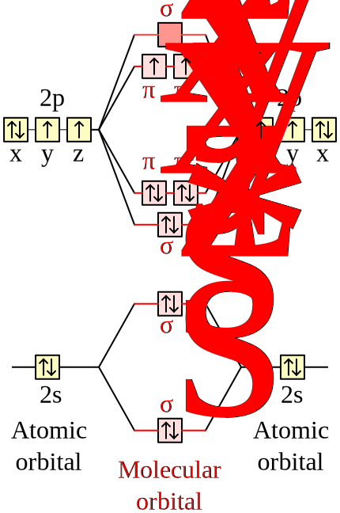

Metals, Spin Polarization and Magnetic Systems
==============================================

This week we'll cover two topics: metallic systems and spin. For metals,
there are a couple of complications which mean we have to treat them
differently from systems with a non-zero band gap.

------------------------------------------------------------------------------

## Metals

Metals have a Fermi surface that can be quite complex in k-space. This means
that in contrast to an insulator or semiconductor where every k-point has the
same number of occupied states, **in a metal the number of occupied states can
vary from k-point to k-point**. This makes them more difficult to converge than
other systems. 

In short, there are generally two things you need to do:

1.  Use a denser k-point grid than you would need for a semiconductor or
    insulator. This is to help sampling the rapid change in the Fermi surface at
    different k-points.

2.  Use some smearing scheme. This is in relation to the smearing used in the
    calculation of the [:link: density of
    states](../lab04/readme.md#density-of-states). The difference is that here
    the occupation is also smeared (i.e., can no longer be intergers of 0 and
    1.) Visually, the smeared DOS would look like the following:

    where the occupation function (Fermi-Dirac function) is plotted in red. The
    Fermi energy is obtaeind by solving the following equaion:
    $$ 
    \int_{-\infty}^{\varepsilon_F} \mathrm{DOS}(\varepsilon) f_T(\varepsilon)
    d\varepsilon = N_e 
    $$
    where $N_e$ is the number of electrons in the system and $f$ represents the
    Fermi-Dirac distribution function at temperature $T$. As we already know, 
    the Fermi-Dirac function at 0K is a step function which would spoil the
    convergence of metals. Here, we simply raise the temperature to a small
    number (`degauss`) so that the Fermi-Dirac function is smeared out and the
    Convergence can be more easily achieved. It is worth noting that other
    smearing methods such as gaussian smearing can also be used.

    Adding a smearing helps significantly in achieving a smooth
    SCF convergence, as otherwise a small change in a state energy from once
    cycle to the next could lead to a very large change in its occupation and to
    the total energy in turn (this is called 'ill-conditioning'). 
    We set the smearing scheme and width with the `occupations` and `degauss` 
    variables in the input file.

Example: Aluminium
------------------

Aluminium forms in a standard fcc structure with one atom per cell, which we
know how to deal with at this point. The thing about Aluminium that makes it
more complicated within DFT is that it is a metal.

Here is an example input file for a calculation of Aluminium:

```python
 &CONTROL
    pseudo_dir = '.'
 /

 &SYSTEM
    ibrav =  2
    A = 2.863
    nat =  1
    ntyp = 1
    ecutwfc = 18.0
    occupations = 'smearing' #(1)!
    smearing = 'fermi-dirac' #(2)!
    degauss = 0.1d0 #(3)!
 /

 &ELECTRONS
 /

ATOMIC_SPECIES
 Al  26.982  Al.pz-vbc.UPF

ATOMIC_POSITIONS crystal
 Al 0.00 0.00 0.00

K_POINTS automatic
  8 8 8 1 1 1
```

1.    The `occupations` variable is set to `smearing` to tell Quantum Espresso
      to use a smearing scheme [:link:input 
      description](https://www.quantum-espresso.org/Doc/INPUT_PW.html#idm362).
2.    The `smearing` variable is set to `fermi-dirac` to tell Quantum Espresso
      to use a Fermi-Dirac smearing scheme. [:link:input
      description](https://www.quantum-espresso.org/Doc/INPUT_PW.html#idm404). 
3.    The `degauss` variable is set to 0.1d0 to set the width of the smearing.
      see [:link:input
      description](https://www.quantum-espresso.org/Doc/INPUT_PW.html#idm401).


!!! example "Task 1 - Smearing"

    First, run the `pw.x` calculation with the supplied input file in
    [`01_aluminium/Al.in`](01_aluminium/Al.in).
    
    Then, look in the `pwscf.xml` file and find the various `ks_energies`
    entries towards the end. These give the various k-points used in the
    calculation and the energies and occupations of each state for this k-point.
    Note, for a metal the default number of bands is at least four more than are
    needed for the number of electrons per cell. The pseudopotential we have
    used has 3 valence electrons, which could be represented with two
    potentially doubly occupied bands, so we have four more bands in the
    calculation for a total of 6.
    
    Now, try removing the `occupations` and `degauss` variables from the input
    file and see what happens when you try to run the calculation.

------------------------------------------------------------------------------

Spin Polarization
-----------------

Up till now we have been assuming that we always had some set of bands which
could each fit two identical electrons. Essentially we have been ignoring
the electron spin. If you want to examine, for example, a magnetic system
then the spin of the electrons is important. It can also be important
in modelling atomic or molecular systems. We'll cover different examples
of this in this lab. 


The Oxygen Molecule
-------------------

If a system is not necessarily magnetic we might imagine that representing 
it with some set of fully occupied, doubly degenerate bands will work. However,
in some cases including spin polarization can lead to important differences. One
example of this is the O2 molecule.

{: style="width:250px" align=right}

In this case, we have a system with two interacting oxygen atoms. Each oxygen
has 8 electrons in total, with the configuration `1s2 2s2 2p4` (the 1s orbital
will be contained within the pseudopotential for the DFT calculations done
here, so you will have 6 electrons from each oxygen atom). 

For a single oxygen, from Hund's rule the three p orbitals should be filled
singly before being filled in pairs, so that one of the p-orbitals will have two
electrons, and the other two should have one each. However, if we assume doubly
occupied orbitals, we'll have the two p-orbitals with two electrons and one that
is empty. This means a calculation where we assume a set of doubly occupied
bands will have trouble converging to the ground state of the system. For the
molecule the situation is similar, but the s and p orbitals from each atom
combine to form bonding and anti-bonding $\sigma$ and $\pi$ orbitals.

The directory `02_O2` contains an input file to calculate the total energy of
the system at the measured bond length. Here the calculation has been set up
exactly as you've seen in the past (i.e., assuming doubly degenerate band
occupation without smearing or spin polarization:

```python
 &CONTROL
    pseudo_dir = '.'
 /

 &SYSTEM
   ibrav = 1
   A = 10
   nat = 2
   ntyp = 1
   nbnd = 8
   ecutwfc = 60.0
 /

 &ELECTRONS
 /

ATOMIC_SPECIES
 O  15.9999  O.pz-rrkjus.UPF

ATOMIC_POSITIONS angstrom
 O  0.0   0.0  0.0   0 0 0
 O  1.48  0.0  0.0   1 0 0

K_POINTS gamma
```

!!! example "Task 2.1 - Assming Spin Degenerate Insulator"

    Try running the calculation in this directory.
    
    While it's possible that the system may randomly meet the convergence
    criteria in the self-consistent cycle, this calculation will most likely
    not converge. If you look at the estimate accuracy at the end of each
    iteration in the output, it will likely vary from step to step, rather than
    steadily decreasing as in a well-behaved calculation.
    
    The situation we have is similar to a metal: we have two bands and the ground
    state of the system should be when there is one electron in each of them.

To get around this, we can use a metallic occupation scheme with a small
smearing width. This will allow the system to converge to the correct ground
state. The relevant input variables are the ones highlighed below:

```python hl_lines="12-14"
 &CONTROL
    pseudo_dir = '.'
 /

 &SYSTEM
   ibrav = 1
   A = 10
   nat = 2
   ntyp = 1
   nbnd = 8
   ecutwfc = 60.0
   occupations = 'smearing' 
   smearing = 'fermi-dirac'
   degauss = 0.1d0
 /

 &ELECTRONS
 /

ATOMIC_SPECIES
 O  15.9999  O.pz-rrkjus.UPF

ATOMIC_POSITIONS angstrom
 O  0.0   0.0  0.0   0 0 0
 O  1.48  0.0  0.0   1 0 0

K_POINTS gamma
```

!!! example "Task 2.2 - Assuming Spin Degenerate Metal]"

    Create a copy of the `02_O2` directory called `02_O2_metal`. Modify the
    input file in it to use a metallic occupation scheme with a small smearing
    width and run the calculation (as above). 

    - Does the calculation now converge?
    - Take a look at the file `pwscf.xml` in the calculation directory, and
      try to find the occupations of each band at each k-point. Are these as
      expected?

While treating this system as a metal may help converging the calculation, it
may not necessarily reach the ground state since the spin-degress of freedom is
constrained. Instead, we can do a spin polarized calculation by adding `nspin`
and `tot_magnetization` variables to the input file (highlighted below):

```python hl_lines="12-13"
 &CONTROL
    pseudo_dir = '.'
 /

 &SYSTEM
   ibrav = 1
   A = 10
   nat = 2
   ntyp = 1
   nbnd = 8
   ecutwfc = 60.0
   nspin = 2 #(1)!
   tot_magnetization = 2.0 #(2)!
 /

 &ELECTRONS
 /

ATOMIC_SPECIES
 O  15.9999  O.pz-rrkjus.UPF

ATOMIC_POSITIONS angstrom
 O  0.0   0.0  0.0   0 0 0
 O  1.48  0.0  0.0   1 0 0

K_POINTS gamma
```

1.    `nspin`: this is 1 by default so no spin polarization is taken into 
      account. To perform a spin polarized calculation it should be set to 2.
2.    `tot_magnetization`: this is difference between the number of spin-up and
      spin-down electrons in the cell. If we want a single spin up electron
      we can set this to `1.0`.

!!! example "Task 2.3 - Assuming Spin Polarized Metal"

    Create another copy of `02_O2` called `02_O2_spin`. Then, try to:
    1. Only turn on spin polarization.
    2. Setting the total magnetization to 0, which would be the case if we 
       don't have any net magnetization in the molecule, as both spins point in
       opposite directions. 
    3. Setting the total magnetization to 2.0, which corresponds
       to both spins pointing in the same direction.

    - How does the total energy compare for each case compare to the metallic
      scheme? Which is the more energetically favourable configuration? How do
      the orbital energies vary?

Finally, comparing the energy of the spin polarized calculation with the spin
degnerate metal calculation, we can see that the spin polarized calculation
gives a lower energy.

!!! pied-piper "Fun facts"
    O2 in its singlet state can be dangerous (see e.g. 
    [`this paper`](https://www.sciencedirect.com/science/article/pii/S1383574211001189)),
    so treating the spin correctly is important!


Iron
----

Now that you've seen how including spin polarization can allow us a correctly
describe the ground state of our system in your calculation, the next step
is to use it to describe a magnetic system.

In a magnetic system there is a net spin polarization in the unit cell. This
means that we'll probably have an odd number of electrons, and the energy of
the system when we include a net spin polarization is lower than the energy
when we don't.

One of the most common magnetic systems is iron, so we'll examine this. The
directory `03_Fe` contains an input file for iron. Note this is a BCC structure
(as set by `ibrav = 3` in the input file), whereas most of the crystals
structures you have examined previously were FCC. The calculation has been set
up in the usual way for a metallic system.

!!! example "Task 3.1 - fixed magnetization"

    - Run this calculation and check everything worked as expected.
    - Now make a copy of the calculation directory and in this, modify the
      calculation to turn on spin polarization. Try running the calculation
      with `tot_magnetization = 0.0` first, and compare your total energy to that
      obtained using doubly degenerate bands. 
      !!! note "Note" 
          while in the case of the O2 above, we were able to get our
          calculations to at least converge by using a metallic occupation
          instead of using spin polarization, in the case of iron, it will still
          be a metal when you use spin polarization, so you should not remove
          the input variables associated with this. 
      The total energies should agree within the accuracy of the calculation.
    - Now try setting the total magnetization to 1.0 and see how total energy
      changes.
        - Which is the more energetically favourable configuration?
    - Try setting the total magnetization to 2.0.
        - How does this compare to the previous value?

From this we could test many guesses for the total magnetization, and find
the value which gives the lowest overall total energy. However, we can instead
pass an option that tells quantum espresso to automatically find the best
value. This is done by setting the `starting_magnetization` input variable.

!!! example "Task 3.2 - Relaxed magnetization"
    - Make another copy of the `03_Fe` directory, and this time set `nspin = 2`,
      and `starting_magnetization = 1.0` (do not include the
      `tot_magnetization` variable as this fixes a value). Run the calculation
      and see what the final total magnetization per cell is. See if you can
      find a measured value for iron to compare to.
    
    - See if you can use what we covered in previous labs to calculate and make a
      plot of the electronic band structure of BCC Fe.
        - Plot the spin-up and spin-down bands in different colours.
        - There are different Fermi energies for the spin-up and spin-down bands:
          indicate these on your plot in some sensible way.
        - As the Brillouin zone is different to the ones you have calculated so
          far you'll need to select a few sensible high-symmetry points yourself
          to plot with.

------------------------------------------------------------------------------

Summary
-------

In this lab you have seen:

- How to treat a metallic system.
- How to do a DFT calculation including spin polarization.
- How some systems need to be done with spin polarization to converge to the
  correct ground state.
- How to use spin polarized calculations to find the correct magnetization of a
  magnetic system by letting the code find the total magnetization that produces
  the lowest overall total energy.
